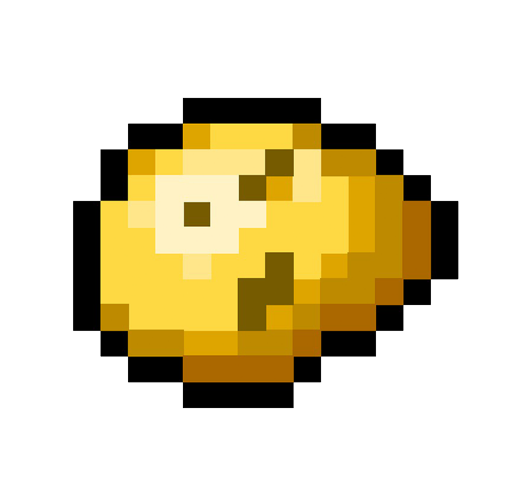

# Aurora
[](https://github.com/MR5356/aurora/actions?query=branch%3Amaster)
[](https://goreportcard.com/report/github.com/MR5356/aurora)
[](https://hub.docker.com/r/toodo/aurora/tags)
[](https://github.com/MR5356/aurora/releases)



----

Aurora is an open source system for DevOps.

----

## To start using Aurora

See our documentation on [docker.ac.cn](https://docker.ac.cn)

## To start developing Aurora

The [repository](/) hosts all information about 
building Aurora from source, how to contribute code 
and documentation, who to contact about what, etc.

##### If you have a working Go environment
```shell
git clone https://github.com/MR5356/aurora.git
cd aurora
make init build
```

## Support

If you have questions, reach out to us one way or another.